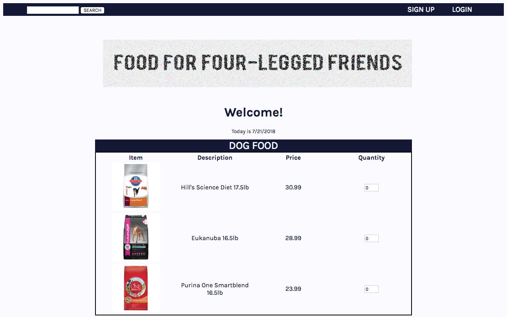

# FOOD FOR FOUR-LEGGED FRIENDS

A make-believe e-commerce site for purchasing pet food. Full-stack application made during Web Development and Programming - NYU Fall 2014 class.

## Code

- PHP, JavaScript, HTML, CSS

## Features
- Form for entering payment and buyer info
  - implemented with JavaScript validation
  - auto-calculates tax and total
  - options for shipping
  - option to subscribe to mailings
- Generates receipt after purchase
- Registration + Login for an account
- Welcomes logged-in guest and shows date
  - Cookies to remember guest

## Screenshot

